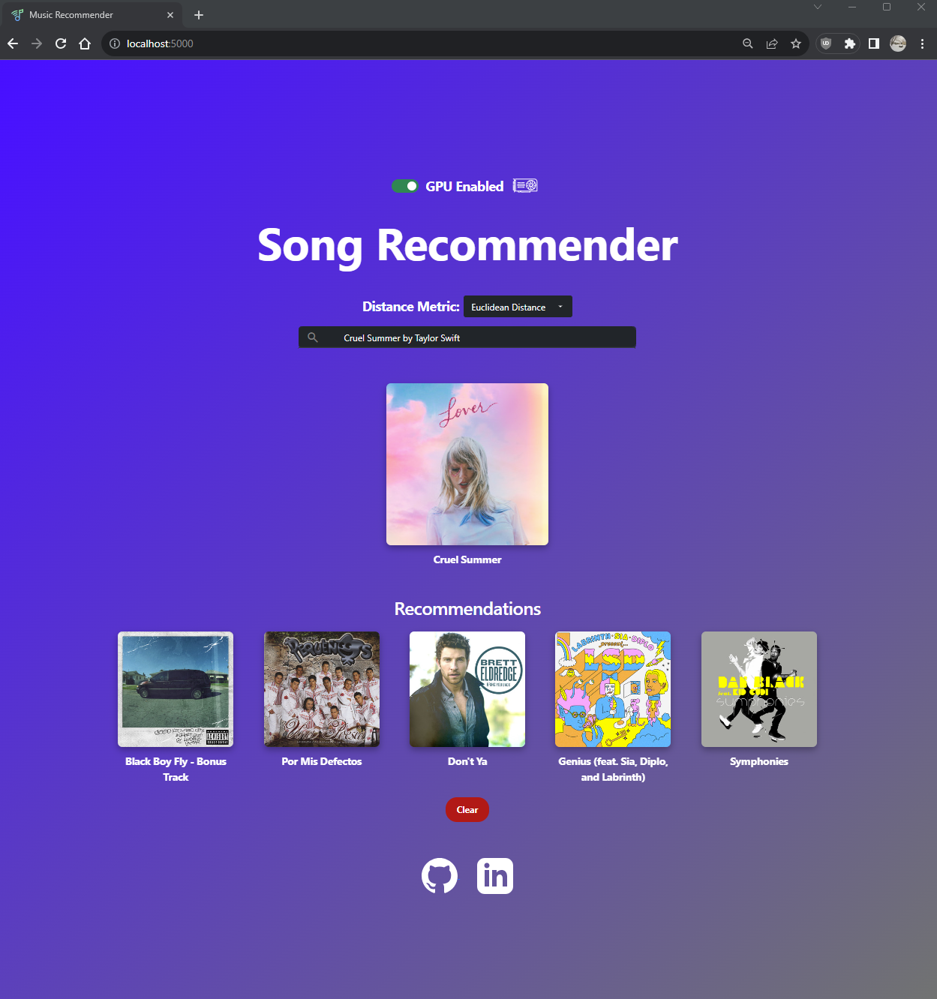

# Music-Recommender
### A similar song finder using KNearestNeighbors, Flask, the Spotify API, and CUDA acceleration.
A web-interface to search for songs you like, and get up to 5 recommendations. The application forwards your search to Spotify, then uses a custom KNearestNeighbors classifier to retrieve the most similar songs from a local dataset of ~170,000 songs. The recommendations are not constrained to be the same genre or artist as the query. Both CUDA GPU acceleration and CPU just-in-time compilation were implemented using [numba](https://numba.pydata.org/).

# Speedup Results
TODO

# Before Starting
Important notes:
1. The system was developed and tested using python 3.11 on Windows.
2. You will need to provide your own Spotify API login credentials
    - Go to https://developer.spotify.com/documentation/web-api, and get your `client_id` and `client_secret`. You can set the redirect url to `http://localhost/`
    - Create `spotify_credentials.txt` in the same folder as `spotify_manager.py`. The file should be a single line formatted as such: `client_id client_secret` (separated by a space). `SpotifyManager` reads these and loads them into `os.environ`.
3. To get the GPU acceleration toggle functioning, you likely need to install the [CUDA toolkit](https://developer.nvidia.com/cuda-toolkit) from NVIDIA.
    - If you prefer to install using conda, you can do: `conda install cuda -c nvidia` (see [Installing CUDA using Conda](https://docs.nvidia.com/cuda/cuda-installation-guide-linux/index.html#conda-installation))
    - Make sure your GPU driver is up to date (via GeForce Experience or NVIDIA directly.)

#### Using conda, these are the exact steps that worked for me on an RTX 3050Ti Laptop:
- Download latest GPU driver using GeForce Experience
- Make a new conda env: `conda create -n music_recommender`
- Install CUDA toolkit: `conda install cuda -c nvidia`

# Usage
1. Install dependencies for the flask app and jupyter notebook: `pip install -r requirements.txt`
    - If you installed the cuda toolkit using conda, be sure to install these dependencies inside the `music_recommender` env you should've created.
2. Launch the Flask app on localhost:5000: `python song_recommender_app.py` (you may need to use `python3` depending on your install).
    - Application logs are generated in `app.log` in the same directory as `song_recommender_app.py`.
3. Go to http://localhost:5000 in the browser. You should be able to search now!
    - If the GPU setup and cuda install worked, the toggle should be available, otherwise it will be grayed-out.
    - The "Distance Metric" toggle allows you to switch between different KNN distance metrics to get different results.

# Files
- `data/`: Stores all `.csv` for the local database. The main one is `data.csv`.
- `static/`, `templates/`: Store css/js/image files and html templates respectively. Part of Flask's file hierarchy. 
- `app.log`: Application logging, created and appended to while running the app (not in the repo).
- `logging_config.py`: Ensures all files have the same logging configuration.
- `models/`: Directory storing all the types of song classifiers used.
    - `distance_metric.py`: Enum class representing all distance metrics the classifiers can support.
    - `gpu_kneighbors.py`: A GPU accelerated custom KNN implementation. Accelerated using CUDA code via `numba`.
    - `knn_song_classifier.py`: Abstract base class that all knn-like classifiers inherit from. Enforces `fit()` and `predict()` interface.
    - `my_k_neighbors_classifier.py`: Implements KNN from scratch via `class MyKNeighborsClassifier`, allowing either euclidean or manhattan distance metrics.
- `recommendations_manager.py`: Implements `class RecommendationsManager`, responsible for taking a query from the user and resolving its recommendations.
- `requirements.txt`: Necessary dependencies to run the flask app and the jupyter notebook.
- `song_recommender_app.py`: The main flask app. Uses the flask development server to serve the application to http://localhost:5000. Prints debug information to the terminal too.
- `song_recommender_exploration.ipynb`: Exploration of the music dataset. Provides visualizations to understand the data, and tests out various KNN implementations. Useful for seeing how different algorithms or distance metrics can provide different recommendations.
- `song.py`: Class to represent Song metadata and audio features.
- `spotify_manager.py`: Wrapper class for calls to the Spotify API using spotipy.
- `trie.py`: Implements a custom Trie datastructure to implement autocomplete on the web interface. The Trie is loaded with the song names from `data.csv`.

## Resources
GPU SVG: gpu by Misha Petrishchev from <a href="https://thenounproject.com/browse/icons/term/gpu/" target="_blank" title="gpu Icons">Noun Project</a> (CC BY 3.0)

Music Note SVG: [Google Material Icons](https://fonts.google.com/icons?icon.query=music+note)

LinkedIn SVG: [iconmonstr](https://iconmonstr.com/linkedin-3-svg/)

GitHub SVG: [iconmonstr](https://iconmonstr.com/github-1-svg/)

Favicon: [flaticon](https://www.flaticon.com/free-icon/spotify_3781901)

CSS framework: [Bootstrap](https://getbootstrap.com/)
